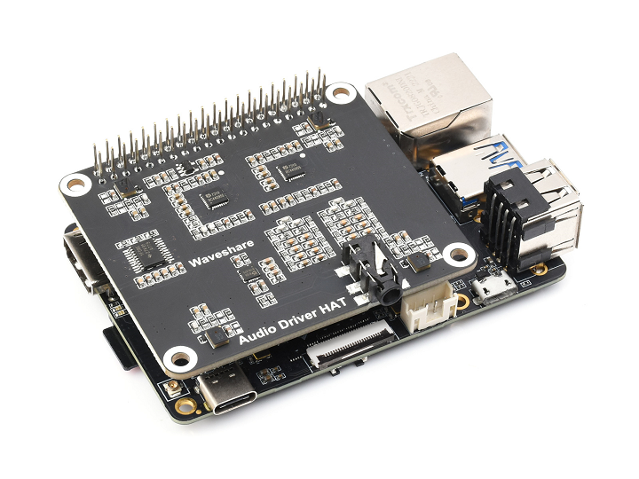

[English](./README.md) | 简体中文

# 功能介绍

**hobot_chatbot** 聊天机器人实现端侧智能聊天功能，聊天过程中无需联网。该应用基于智能语音，大语言模型和文本转语音模块，将智能语音ASR识别结果送给端侧大语言模型处理，得到输出结果，最后通过文本转语音模块播放出来。

# 物料清单

| 机器人名称         | 生产厂家 | 参考链接                                                        |
| :----------------- | -------- | --------------------------------------------------------------- |
| RDK X3 （4GB内存） | 多厂家   | [点击跳转](https://developer.d-robotics.cc/rdkx3)                  |
| 麦克风板           | 微雪电子 | [点击跳转](https://www.waveshare.net/shop/Audio-Driver-HAT.htm) |

# 使用方法

## 准备工作

在体验之前，需要具备以下基本条件：

- 确认RDK为4GB内存版本
- RDK已烧录好Ubuntu 20.04系统镜像
- 音频板正确连接到RDK X3，耳机接口接上耳机或音响
- 安装transformers，命令为 `pip3 install transformers -i https://pypi.tuna.tsinghua.edu.cn/simple`
- 更新hobot-dnn，命令为 `sudo apt update; sudo apt install hobot-dnn`

## 机器人组装

1. 将麦克风板连接到RDK X3 40PIN GPIO 接口上，连接后实物如下图：

    

2. 耳机接口接上耳机或音响

## 安装功能包

启动RDK X3后，通过终端SSH或者VNC连接机器人，复制如下命令在RDK的系统上运行，完成相关Node的安装。

tros foxy 版本
```bash
sudo apt update
sudo apt install -y tros-hobot-chatbot
```

tros humble 版本
```bash
sudo apt update
sudo apt install -y tros-humble-hobot-chatbot
```

## 运行智能聊天机器人

1. 运行程序前，需要下载模型文件并解压

    1. 下载大语言模型文件

       tros foxy 版本
        ```bash
        # 下载大语言模型文件
        wget http://sunrise.horizon.cc/llm-model/llm_model.tar.gz

        # 解压
        sudo tar -xf llm_model.tar.gz -C /opt/tros/${TROS_DISTRO}/lib/hobot_llm/
        ```

       tros humble 版本
        ```bash
        # 下载大语言模型文件
        wget http://sunrise.horizon.cc/llm-model/llm_model.tar.gz

        # 配置tros.b humble环境
        source /opt/tros/humble/setup.bash

        # 解压
        sudo tar -xf llm_model.tar.gz -C /opt/tros/${TROS_DISTRO}/lib/hobot_llm/
        ```

   2. 下载TTS模型

        tros foxy 版本
       ```bash
       wget http://sunrise.horizon.cc//tts-model/tts_model.tar.gz
       sudo tar -xf tts_model.tar.gz -C /opt/tros/${TROS_DISTRO}/lib/hobot_tts/
       ```

        tros humble 版本
       ```bash
       wget http://sunrise.horizon.cc//tts-model/tts_model.tar.gz
       source /opt/tros/humble/setup.bash
       sudo tar -xf tts_model.tar.gz -C /opt/tros/${TROS_DISTRO}/lib/hobot_tts/
       ```

2. 修改BPU保留内存大小和设置CPU频率

    修改BPU保留内存大小为1.7GB，设置方法参考[TODO]()。

    重启后调整CPU最高频率为1.5GHz，以及设置调度模式为`performance`，命令如下：

    ```bash
    sudo bash -c 'echo 1 > /sys/devices/system/cpu/cpufreq/boost'
    sudo bash -c 'echo performance > /sys/devices/system/cpu/cpufreq/policy0/scaling_governor'
    ```

3. 配置智能语音模块和加载音频驱动
   
   1. 拷贝配置文件

       tros foxy 版本
        ```shell
        # 从tros.b的安装路径中拷贝出运行示例需要的配置文件，若已拷贝则可忽略
        cp -r /opt/tros/${TROS_DISTRO}/lib/hobot_audio/config/ .
        ```

        tros humble 版本
        ```shell
        source /opt/tros/humble/setup.bash
        # 从tros.b的安装路径中拷贝出运行示例需要的配置文件，若已拷贝则可忽略
        cp -r /opt/tros/${TROS_DISTRO}/lib/hobot_audio/config/ .
        ```

   2. 修改 *config/audio_config.json*，将`asr_mode`字段为`1`。

   3. 确认音频设备设置正确，具体设置方法参考RDK用户手册[音频转接板](https://developer.horizon.cc/documents_rdk/hardware_development/rdk_x3/audio_board)章节。

4. 配置tros.b环境和启动应用

    tros foxy 版本
    ```shell
    # 配置tros.b环境
    source /opt/tros/setup.bash

    # 屏蔽调式打印信息
    export GLOG_minloglevel=3

    #启动launch文件
    ros2 launch hobot_chatbot chatbot.launch.py
    ```

    tros humble 版本
    ```shell
    # 配置tros.b humble环境
    source /opt/tros/humble/setup.bash

    # 屏蔽调式打印信息
    export GLOG_minloglevel=3

    #启动launch文件
    ros2 launch hobot_chatbot chatbot.launch.py
    ```

    启动成功后，使用唤醒词“地平线你好”唤醒机器人，唤醒后即可同机器人聊天。注意，开启每轮对话时，都要先使用唤醒词“地平线你好”唤醒机器人。

# 接口说明

## 话题

| 名称         | 消息类型                                                                                                               | 说明                       |
| ------------ | ---------------------------------------------------------------------------------------------------------------------- | -------------------------- |
| /audio_smart | [audio_msg/msg/SmartAudioData](https://github.com/D-Robotics/hobot_msgs/blob/develop/audio_msg/msg/SmartAudioData.msg) | 发布智能语音处理的智能结果 |
| /audio_asr   | std_msgs/msg/String                                                                                                    | 发布ASR识别结果            |
| /tts_text    | std_msgs/msg/String                                                                                                    | 发布大语言模型结果         |

# 常见问题

1. 机器人无应答？

- 确认音频设备连接是否正常，并连接耳机或音响
- 确认是否加载音频驱动
- 确认加载音频驱动前是否已有音频设备连接
- 确认 *config/audio_config.json* `asr_mode`字段为`1`
- 确认开发板内存为4GB，同时修改BPU保留内存大小为1.7GB
